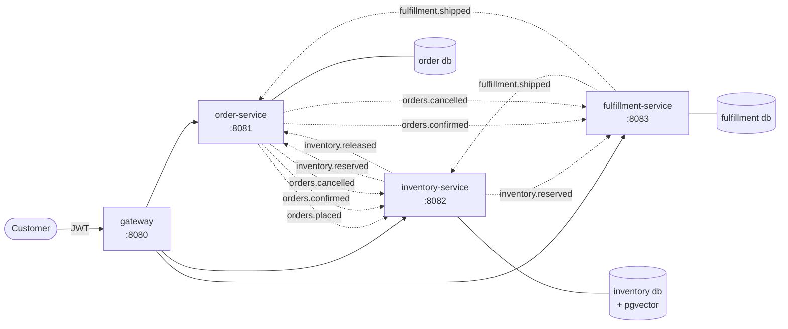

# FreshChain

**Order and inventory reservation platform for perishable-goods distribution.**

Three Spring Boot services coordinating over Kafka behind a Spring Cloud
gateway, with a React storefront, lot-level inventory, first-expired-first-out
allocation, and a saga that compensates when things go wrong. Everything runs
in Docker; nothing needs to be installed on your machine except Docker itself.

---

## The problem this solves

In foodservice distribution, inventory is not fungible. You do not have
"500 units of chicken breast" — you have lot A (300 units, expires 20 Aug) and
lot B (200 units, expires 2 Sep).

Every allocation decision has to choose *which lot*, and that single constraint
generates everything interesting here:

| Constraint | What it forces |
|---|---|
| **FEFO allocation** | Nearest-expiry stock goes out first, to minimise spoilage |
| **Partial fulfilment** | Deciding what happens when stock is short of the order |
| **Concurrency** | Two orders racing for the same lot must never oversell |
| **Reservation expiry** | Held stock must come back if the order is never confirmed |
| **Distributed consistency** | Three services, three databases, no distributed transactions |

## Architecture



Each service owns its schema. No service reads another's tables. Every topic is
keyed on `orderId`, so all events for one order land on one partition and are
consumed in the order they were produced — which is the ordering guarantee the
saga actually needs.

### The happy path

```
POST /orders
  → order-service:      INSERT order + INSERT outbox row      (one transaction)
  → outbox poller:      publish to orders.placed
  → inventory-service:  FEFO allocate, INSERT reservation, outbox inventory.reserved
  → order-service:      status = ALLOCATED | PARTIALLY_ALLOCATED | REJECTED

POST /orders/{id}/confirm
  → order-service:      status = CONFIRMED, publish orders.confirmed
  → inventory-service:  reservation = CONFIRMED (expiry no longer applies)
  → fulfillment-service: create shipment

POST /shipments/{orderId}/ship
  → fulfillment-service: publish fulfillment.shipped
  → inventory-service:   decrement qty_on_hand and qty_reserved, reservation = CONSUMED
```

### When it goes wrong

| Trigger | Compensation |
|---|---|
| `orders.cancelled` | Inventory releases the reservation, `qty_reserved` decremented; fulfillment cancels the shipment |
| Reservation `expires_at` elapses while `HELD` | Sweeper releases it, publishes `inventory.released` |
| Order confirmed *after* the sweeper already released it | Inventory re-announces the release; order-service cancels the order |
| Allocation fully rejected | Order status `REJECTED`, no reservation created |
| Consumer cannot parse a payload | Three retries, then the record is parked on `<topic>.DLT` |

---

## Learning from this repository

This project was built to be studied as well as run, so it ships with two
companion guides. Both use this codebase as their only material.

| Guide | Covers |
|---|---|
| **[Annotated FreshChain](https://claude.ai/code/artifact/1d137e16-1f80-4710-b56a-999437272326)** | The **code**: domain modelling, concurrency and the oversell problem, the saga, the transactional outbox, event contracts, testing strategy, layered security. Ten modules, each ending with a deliberate change that makes a named test fail. |
| **[Ship Manual](https://claude.ai/code/artifact/a160c4ba-4424-496f-8847-c6a383662dc8)** | The **deployment**: git and CI, container registries, provisioning an Oracle Cloud VM, TLS, continuous delivery, day-two operations, then Kubernetes, Jenkins and the classic toolchain. Twelve phases. |

The 102 tests are the answer key for the first guide; `k8s/`, `Jenkinsfile` and
`.github/workflows/ci.yml` are the working material for the second.

---

## Quickstart

Docker is the only prerequisite. The Gradle build itself runs in a container.

Identity is the one thing that is not local: FreshChain authenticates against
**[Asgardeo](https://asgardeo.io)**, WSO2's hosted IAM service. Set that up first
— about fifteen minutes, walked through in
**[docs/asgardeo-setup.md](docs/asgardeo-setup.md)** — then:

```bash
cp .env.example .env   # Asgardeo org + both client ids (CLI and SPA)
make login             # browser sign-in, once per demo user; tokens cached
make check-idp         # decodes a cached token and reports what is in it
make infra             # Postgres, Kafka, Redis, Prometheus, Grafana
make up                # build and start the four services
make seed              # receive demo stock through the API
make demo              # end-to-end walkthrough
```

`make login` runs an **authorization code + PKCE** flow against Asgardeo: a local
listener catches the callback, and tokens are cached under `.tokens/` and
refreshed silently, so everything after it is non-interactive. The resource owner
password grant would have been simpler to script, but OAuth 2.1 deprecates it and
Asgardeo no longer offers it on any application template.

`make check-idp` is worth running before anything else. Getting roles into a JWT
*access* token is the step most Asgardeo setups miss — attributes go into the ID
token by default — so rather than leave you guessing, it fetches a real token,
decodes it, and names the console setting to change.

| Where | What |
|---|---|
| http://localhost:8080 | Gateway (JWT required) |
| http://localhost:8081/swagger-ui.html | Order API |
| http://localhost:8082/swagger-ui.html | Inventory API |
| http://localhost:8083/swagger-ui.html | Fulfillment API |
| http://localhost:3001 | **FreshChain web app** (React) |
| http://localhost:3000 | Grafana (`admin` / `admin`) |
| https://console.asgardeo.io | Asgardeo console (identity) |

Demo users, created in Asgardeo during setup:

| User | Role | Can |
|---|---|---|
| `alice`, `bob` | `CUSTOMER` | Place, view, confirm and cancel **their own** orders |
| `wanda` | `WAREHOUSE_OPERATOR` | Pick and ship shipments, view inventory |
| `freshchain-admin` | `ADMIN` | Receive stock, adjust lots, view everything |

```bash
TOKEN=$(./scripts/token.sh customer)   # reads the cache, refreshes if needed
curl -H "Authorization: Bearer $TOKEN" \
     "http://localhost:8080/api/v1/inventory/CHK-BRST-5LB/availability?warehouseId=WH-COL-01"
```

---

## The concurrency test

This is the one to read first. Fifty threads race for ten units:

```
ConcurrentReservationIT > 50 concurrent reservations against 10 units allocate exactly 10 PASSED
ConcurrentReservationIT > the database refuses an oversell even if the application logic is bypassed PASSED

outcome of 50 concurrent single-unit reservations against 10 units: {FULL=10, REJECTED=40}

lot.qty_reserved           = 10
lot.qty_on_hand            = 10   (nothing has shipped yet)
sum(reservation_line.qty)  = 10
reservations created       = 10
```

```bash
make concurrency
```

What makes it pass is a blocking `SELECT ... FOR UPDATE` ordered by expiry, not
`SKIP LOCKED`. `SKIP LOCKED` is the intuitive choice and it is wrong here: under
contention on a single lot every caller skips the locked row, finds no other
candidate, and is told there is no stock — while the units sit on the shelf. It
also silently breaks FEFO by hopping to a later-expiring lot.

Postgres re-checks the `qty_on_hand > qty_reserved` predicate after granting a
blocked lock, so a lot another transaction has just exhausted drops out of the
result instead of being handed out twice. That is what makes "exactly 10 of 50"
fall out of the query itself. The full reasoning is in
[ADR-002](docs/adr/ADR-002-pessimistic-locking-for-allocation.md).

A database `CHECK (qty_reserved <= qty_on_hand)` sits behind all of it. The
second test writes straight at the table, around the entity and the service, to
prove that constraint is real rather than decorative.

## The chaos test

Kafka is paused mid-run to prove the transactional outbox earns its keep:

```
broker paused; placing orders into the outage
5 event(s) queued in the outbox while the broker was unreachable
broker resumed; waiting for the publisher to drain the backlog
outbox fully drained after broker recovery
```

```bash
make chaos
```

Orders are still accepted while the broker is unreachable, every event survives
in Postgres, and the backlog drains on recovery with no operator involvement.

---

## Testing

| Layer | Tool | What it covers |
|---|---|---|
| Unit | JUnit 5 + AssertJ | FEFO ordering, exact fit, shortfall, expired lots, allergen guard, lot invariants |
| Integration | Testcontainers **Postgres** | Lock behaviour, check constraints, reservation lifecycle, expiry sweep |
| Integration | Testcontainers **Kafka** | Outbox → broker round trip, consumer idempotency, DLT routing |
| Contract | MockMvc + Spring Security Test | Status codes, role rules, ownership |
| Concurrency | `ExecutorService` + `CountDownLatch` | The headline oversell test |
| Chaos | Testcontainers + Docker pause | Broker outage and recovery |
| Load | k6 | p95/p99 under contention |

```bash
make unit          # fast, no containers
make test          # everything except chaos
make chaos         # broker outage
make load          # k6 against the gateway
```

**102 tests, all green**, in about a minute:

```
order-service           18 tests, 0 failed
inventory-service       67 tests, 0 failed
fulfillment-service     17 tests, 0 failed
TOTAL                   102 tests, 0 failed
```

Testcontainers runs **real Postgres and real Kafka**, locally and in CI. The
behaviour under test — `FOR UPDATE` semantics, check constraints, partial
indexes, consumer group offsets — is exactly what a mock would have to pretend
to have.

The inventory service is tested against `pgvector/pgvector:pg16`, the same image
production runs, rather than stock Postgres. Testing against a different image
than you deploy is how surprises get shipped.

---

### Load

20 virtual users for 60 seconds against the gateway, placing orders and reading
them back:

```
checks.........................: 100.00%  (0 failed)
http_reqs......................: 11516    190.9/s
http_req_failed................: 0.00%    0 out of 11516

order_placement_duration.......: med=3.04ms   p(90)=7.48ms   p(95)=12.28ms
http_req_duration..............: med=2.25ms   p(90)=5.72ms   p(95)=9.53ms
```

Read those numbers for shape, not for capacity: this is a laptop running
Postgres, Kafka, Redis, Prometheus, Grafana and four JVMs at once, so
they say more about the machine than about the ceiling.

Two things in the profile are worth knowing. The gateway's rate limiter buckets
per JWT subject, so a single-user run measures the limiter rather than the system
behind it — `make load` raises the limit for the run and spreads traffic across
two users. And `429` is registered as an expected status, because a throttled
request is the limiter working, not a failure.

## Three modelling decisions worth defending

**Available quantity is derived, never stored.** `qty_on_hand - qty_reserved` is
computed on read. Storing it would create a third value free to drift out of step
with the other two.

**The check constraint is the last line of defence.** Application logic should
never let `chk_reserved_le_onhand` fire. If it ever does, the database refuses
the write rather than silently recording an oversell.

**The partial index matches the query shape.** `idx_lot_fefo` covers only lots
with stock left to give (`WHERE qty_on_hand > qty_reserved`), and its column
order — `sku, warehouse_id, expiry_date` — matches the FEFO query's
filter-then-sort shape exactly.

## The allocator is a plain object

`FefoAllocator` takes a list of lot snapshots and a quantity and returns an
`AllocationResult`. No Spring, no JPA, no repository, no clock — the allocation
date is passed in so results are deterministic under test. Holding row locks and
persisting the decision is somebody else's job.

That separation is why the arithmetic and the concurrency can be tested
independently: the algorithm suite runs in milliseconds with no database, and the
concurrency test exercises locking without re-testing the arithmetic.

`AllocationResult` is a sealed interface over `Full | Partial | Rejected`, so
every call site is forced to handle a partial allocation as a first-class outcome
rather than as an exception or a null.

**A limitation stated deliberately:** greedy FEFO is locally optimal and globally
suboptimal. One large order can drain every near-expiry lot that several small,
soon-to-be-delivered orders could have absorbed, pushing spoilage elsewhere in the
network. A production system would weigh remaining shelf life against the
consuming order's own delivery date.

---

## Security

**Asgardeo** is the identity provider — WSO2's hosted IAM service, so there is no
identity container to run, seed or keep patched. Every service is an OAuth2
resource server validating JWTs against Asgardeo's published JWKS. The gateway
validates once at the edge; **each service validates again**, because a service
must not trust the network it is sitting on — anything that can reach port 8082
directly would otherwise be unauthenticated.

Audience is validated too, against this deployment's client id. Without that, a
validly-signed token minted for any *other* application in the same Asgardeo
organisation would be accepted here.

Using a hosted provider removed a class of configuration rather than adding one.
A self-hosted provider is reachable at two different addresses — one from the
containers, one from the host — so the issuer in the token can never match both,
and the JWKS URL has to be pinned separately. Asgardeo has one public HTTPS
address for everybody, and that problem does not arise.

Roles are read from the access token by
[`JwtRoleConverter`](inventory-service/src/main/java/com/freshchain/inventory/config/JwtRoleConverter.java),
which normalises the shapes real tokens arrive in — array or delimited string,
`roles` or `groups`, `Internal/admin` or `warehouse-operator` — so the
authorisation rules stay readable and stay identical whichever provider issued
the token. Nine unit tests cover those shapes.

Role checks are method-level (`@PreAuthorize`). Ownership is enforced in the
service layer, because a valid `CUSTOMER` token authorises the *endpoint*, not
somebody else's order:

```
OrderApiIT > a customer reading another customer's order gets 403, not 404 PASSED
OrderApiIT > a customer cannot confirm somebody else's order either PASSED
OrderApiIT > an admin may read any order PASSED
```

403 rather than 404 is deliberate: the caller is authenticated and the order does
exist. 404 would leak nothing, but it would also lie.

**The interesting problem: a Kafka record has no security context.** Identity
travels in the `actor` field of the event envelope, and the consumer trusts the
producing service rather than re-validating a token it cannot refresh — a token
minted at placement may well have expired before the sweeper releases the
reservation fifteen minutes later. The trust boundary is the network between
services, not the message.

Rate limiting sits at the gateway: a Redis token bucket keyed on the JWT subject,
so one noisy customer cannot spend everybody else's budget. Keying on IP would
lump every customer behind one corporate NAT into a single bucket.

---

## The AI feature, scoped tightly

When allocation comes back `PARTIAL` or `REJECTED`, the inventory service
suggests alternate SKUs that are **actually in stock in the same warehouse**.

1. `ProductEmbeddingLoader` embeds the catalogue into pgvector at startup, once,
   idempotently.
2. `VectorSubstitutionAdvisor` runs a similarity search and over-fetches.
3. Three hard filters, all deterministic: drop the product itself, drop anything
   without real unexpired stock, then **`AllergenGuard`**.

> **The model proposes; the rules engine disposes.**

A similarity search does not know what an allergen is. It will happily rank a
sesame burger bun next to a plain sub roll, because they read almost identically.
Suggesting the first to someone who ordered the second is a food-safety incident,
not a bad recommendation. So model output never reaches a customer without
passing plain set logic with no inference anywhere in it. The rule is
one-directional: a substitute may *drop* allergens, never *introduce* one.

```
AllergenGuardTest > a substitute that would introduce a new allergen is blocked PASSED
AllergenGuardTest > a substitute carrying fewer allergens is allowed PASSED
SubstitutionAdvisorIT > a bun carrying sesame is never offered against a roll that does not PASSED
```

**It runs with no API key.** The vector store, the similarity search and the
guard are all real; the embedding function behind them is swappable and defaults
to `HashingEmbeddingModel` — hashed bag-of-words plus character trigrams,
L2-normalised, offline and deterministic. On a product catalogue it is genuinely
useful:

```
cosine similarity — chicken/chicken 0.790, chicken/salmon 0.130
```

It is not a language model and makes no semantic claims: it will not know that
"scallion" and "spring onion" are the same thing. Set
`spring.ai.model.embedding=openai` with a key and Spring AI's own
auto-configuration takes over. The output dimension is deliberately 1536 — the
same as OpenAI's — so switching needs no schema migration.

---

## Observability

- Actuator health, readiness and liveness on every service
- Micrometer → Prometheus → one Grafana dashboard: consumer lag, allocation
  latency percentiles, outbox backlog, DLT depth, reservation-release rate
- kafka-exporter for the broker-side view (topic offsets, and with them DLT
  depth) that the services' own registries cannot see
- Micrometer Tracing with OpenTelemetry; one trace spans order → inventory →
  fulfilment across the Kafka hops
- Structured logging with `orderId` in the MDC, so a single order can be grepped
  end to end across three services

```
trace 516355f2b741ac62…   order=1  inventory=1  fulfillment=1
trace 83c917f674771d0a…   order=1  inventory=1  fulfillment=1
```

**Getting that to work took one non-obvious fix.** The outbox breaks the
automatic trace chain by design: the publish happens on a scheduled poller
thread, long after the request that caused it. Spring Kafka's producer-side
observation will happily inject a `traceparent` — but the span active at send
time is the *poller tick*, so every consumer ends up joined to a trace that
represents nothing anyone wants to read.

So the W3C `traceparent` of the originating request is captured when the outbox
row is written, stored alongside it, and re-attached as a Kafka header by the
publisher. Producer observation is switched **off**
(`spring.kafka.template.observation-enabled: false`) so that header survives;
consumer observation stays on, so the listener continues the caller's trace.

---

## Repository layout

```
freshchain/
├── common-events/          # wire contracts. No Spring, no JPA, on purpose
├── gateway/                # routing, JWT validation, Redis rate limiting
├── order-service/          # order aggregate and lifecycle
├── inventory-service/      # lots, reservations, FEFO, substitution
├── fulfillment-service/    # shipments, stock consumption
├── load/                   # k6
├── ops/                    # Dockerfile, Prometheus, Grafana
├── k8s/                    # Kustomize base + prod overlay for Kubernetes
├── Jenkinsfile             # the CI pipeline again, as Jenkins runs it
├── docs/adr/               # three decision records
└── scripts/                # gradle-in-docker, token, seed, demo
```

`common-events` is deliberately free of Spring and JPA. It is the contract
between services, and a consumer must not be able to couple itself to a
producer's runtime.

The outbox, idempotency guard and envelope reader are duplicated per service
rather than shared as a library — the services are independently deployable, and
one service's upgrade must not force another's. `scripts/_sync-shared.sh` keeps
the copies honest.

---

## Explicitly out of scope

Naming your own boundaries is not the same as having gaps.

- **Payments** — the confirm endpoint stands in for payment capture
- **Real warehouse management** — no picking routes, wave planning or barcode scanning
- **Pricing engine** — unit prices are static per SKU, no contract or volume pricing
- **Multi-tenancy** — one tenant, one price list
- **Cloud deployment** — infrastructure and deploy pipeline are handled separately

## Deploying somewhere public

The compose file already assumes a hostile network: only the frontend and the
gateway publish beyond loopback — Postgres, Kafka, Redis, Prometheus, Grafana
and the three services bind to `127.0.0.1`, so on a server you reach them over
an SSH tunnel. On top of that, set in `.env`:

| Variable | Why |
|---|---|
| `POSTGRES_PASSWORD` | database password, defaults to `freshchain` |
| `GRAFANA_ADMIN_PASSWORD` | Grafana admin, defaults to `admin` |
| `FRESHCHAIN_API_DOCS_ENABLED=false` | Swagger UI and `/v3/api-docs` are anonymous by design |
| `FRONTEND_URL` | the public address; register it as a redirect URL on the Asgardeo SPA app |

TLS is not the stack's job: terminate it in front (a reverse proxy with
certificates, or your cloud's load balancer) before exposing anything.

### Kubernetes

`k8s/` holds a Kustomize base and a `prod` overlay. The Spring `docker`
profile's service URLs are plain DNS names, so Kubernetes Services satisfy
them unchanged — no application config differs between compose and a cluster.
Copy `k8s/base/secrets.example.yaml` to `secrets.yaml` (gitignored), then:

```bash
kubectl apply -k k8s/base        # creates the namespace and everything in it
kubectl apply -n freshchain -f k8s/base/secrets.yaml
```

The `prod` overlay pins registry image names and the public hostname;
`Jenkinsfile`'s deploy stage rolls a pinned tag into it. Verified end to end
on k3s: all pods ready, JWT enforcement live, the frontend's `/api` proxy
reaching the gateway in-cluster.

---

## Where this departs from the original design sketch

Five places, each for a reason worth stating rather than hiding.

**Spring Boot 3.5 instead of 3.3.** The 3.3 line is end-of-life. 3.5 is the
current 3.x train, and Spring Cloud 2025.0.x, Spring AI 1.0.x and ShedLock 6.x
all pin cleanly against it.

**Blocking `FOR UPDATE` instead of `FOR UPDATE SKIP LOCKED` for allocation.**
The original sketch specified `SKIP LOCKED`, but that contradicts the headline
test it also specified: on a single contended lot, `SKIP LOCKED` yields one
success and forty-nine spurious rejections, not ten and forty. `SKIP LOCKED` is
still used where skipping is the right behaviour — the outbox publisher and the
expiry sweeper. See [ADR-002](docs/adr/ADR-002-pessimistic-locking-for-allocation.md).

**No ShedLock on the outbox publisher.** The claim query already uses
`SKIP LOCKED`, so several replicas can drain the table concurrently without
double-publishing. A scheduler lock would remove that parallelism and buy
nothing. The expiry sweeper does take one.

**Dead-letter topics named `<topic>.DLT`, explicitly.** Spring Kafka's default is
`<topic>-dlt`. The resolver is configured rather than inherited, so the naming
convention is ours and survives framework upgrades.

**Partial-fulfilment policy is per order, not per line.** This matches the schema
in the design sketch (`orders.allow_partial`) and the `OrderPlaced` payload.
Per-line policy would be an additive change: a column on `order_line` and a
parameter already threaded through `FefoAllocator.allocate`.

## Decision records

| ADR | Decision |
|---|---|
| [ADR-001](docs/adr/ADR-001-events-over-synchronous-rest.md) | Kafka events between services, and the one synchronous call kept on purpose |
| [ADR-002](docs/adr/ADR-002-pessimistic-locking-for-allocation.md) | Blocking `FOR UPDATE` over optimistic locking *and* over `SKIP LOCKED` |
| [ADR-003](docs/adr/ADR-003-transactional-outbox-over-cdc.md) | Polled transactional outbox over Debezium CDC, and when I would switch |

## Tech stack

Java 21 · Spring Boot 3.5 · Spring Cloud Gateway · Spring Kafka · Spring Data JPA
· PostgreSQL 16 + pgvector · Flyway · Redis · Asgardeo · Spring AI · ShedLock ·
Resilience4j · Testcontainers · Micrometer + Prometheus + Grafana · Gradle
(Kotlin DSL) · GitHub Actions

Deliberately skipped, with reasons: **Spring Cloud Config Server** (environment
variables and a parameter store do this), **Eureka** (container orchestration
already provides service discovery), **Spring Cloud Stream** (direct control of
consumer groups, offsets and error handlers was worth the extra code).
